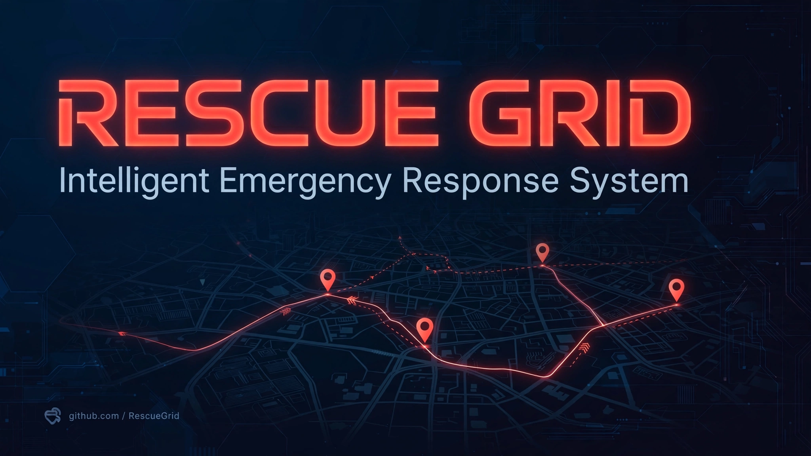

# RescueGrid — Intelligent Emergency Response & Resource Allocation System

> ## Status: 🟢 Completed
>
> <progress value="90" max="100"></progress>
>
> **Progress: 90%** — Complete city-scale emergency simulation: incident generation, priority resource allocation, Dijkstra/A* routing, hospital + supply engines, live dashboard. No TODOs or stubs in code.

<p align="center">
  
</p>


-green)

## What it is

RescueGrid is a Java desktop simulation for emergency response coordination across a city. The city is a weighted graph of intersections, hospitals, fire stations, police stations, warehouses, and residential areas. The simulation continuously generates incidents (medical emergencies, fires, accidents, building collapses, floods, industrial accidents — including 50–200-person mass-casualty events) and dispatches a fleet of ambulances, fire trucks, police vehicles, and rescue teams using priority-based allocation that weighs severity, distance, response time, capability, and workload. Routing uses Dijkstra and A* over a live traffic model, hospitals are selected by capacity/distance/specialty, and supplies (medical kits, blood, oxygen, food, water) are allocated alongside.

## What works (verified)

- ✅ **City simulation** — `CityBuilder` + `City` graph model with nodes, roads, and facility placement (42 Java files total).
- ✅ **Incident generation** — continuous stream of typed incidents with severity levels, including mass-casualty scenarios.
- ✅ **Resource allocation** — `ResourceAllocationEngine` with priority scoring (severity, distance, response time, capability, workload); thread-safe allocation preventing race conditions.
- ✅ **Routing** — `DijkstraRouter` and `AStarRouter` behind a common `Router` interface, with real-time traffic updates via `TrafficManager`; `BenchmarkManager` compares the two algorithms.
- ✅ **Hospital allocation** — `HospitalAllocationEngine` selects by capacity, distance, and specialty.
- ✅ **Supply chain** — `SupplyAllocationEngine` for medical kits, blood units, oxygen, food, water.
- ✅ **Failure injection** — vehicle breakdowns, road closures, hospital overloads to test resilience.
- ✅ **Predictive positioning** — proactive resource placement from historical incident data.
- ✅ **Simulation replay** — record and replay simulation events.
- ✅ **Live dashboard** — `DashboardFrame` (main entry point) + `CityPanel`.
- ✅ **No dead code** — zero TODO/FIXME markers (grep-verified).

*Verified by: reading the package layout (`algorithm/`, `engine/`, `model/`, `simulation/`, `ui/`), `build.sh`, and the allocation/routing engines. Not compiled here — no JDK in this environment; no CI runs on the repo.*

## Tech stack

| Layer | Technology |
|---|---|
| Language | Java 17+ |
| UI | Swing / AWT |
| Algorithms | Dijkstra, A* pathfinding |
| Concurrency | Thread-safe allocation, worker pools |
| Build | `build.sh` (`javac`, no external deps) |

## How to run

```bash
# Requires: Java 17+

cd rescuegrid
./build.sh
# build.sh compiles AND launches:
#   java -cp out com.rescuegrid.ui.DashboardFrame
```

> `build.sh` both compiles and runs the dashboard. Compilation was not re-run here (no JDK in this sandbox), but the script and full source tree are intact.

## Screenshots

No screenshots in the repo. The banner above is the generated visual.

## What you can add more

- [ ] **Add a dashboard screenshot** — capture `DashboardFrame` running and ship it like GridX does
- [ ] **Scenario presets** — save/load named disaster scenarios (earthquake, flood, multi-site attack)
- [ ] **Response-time analytics** — charts of allocation latency by incident type and district
- [ ] **GIS import** — load real city road networks (OpenStreetMap) instead of the generated city
- [ ] **Multi-agency view** — separate dispatch consoles per agency (fire/police/medical) with a shared incident board

## Project structure

```
rescuegrid/
├── build.sh                              # Compile + launch (javac, pure Java)
├── banner.webp                           # Project banner
└── src/main/java/com/rescuegrid/
    ├── algorithm/   # DijkstraRouter, AStarRouter, Router, Route
    ├── benchmark/   # BenchmarkManager (Dijkstra vs A*)
    ├── engine/      # ResourceAllocation, Hospital, Supply, Traffic, FailureInjector
    ├── event/       # Event, EventBus, EventType
    ├── metrics/     # MetricsManager
    ├── model/       # City, Node, Road, Vehicle, Incident, Hospital, Ambulance, …
    ├── simulation/  # SimulationEngine, CityBuilder
    └── ui/          # DashboardFrame (main), CityPanel
```

---
*README written after code audit on 2026-10-08.*
